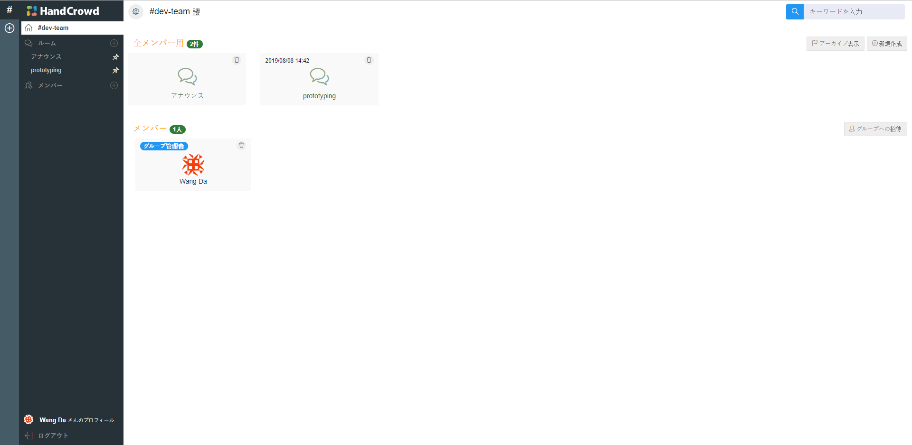
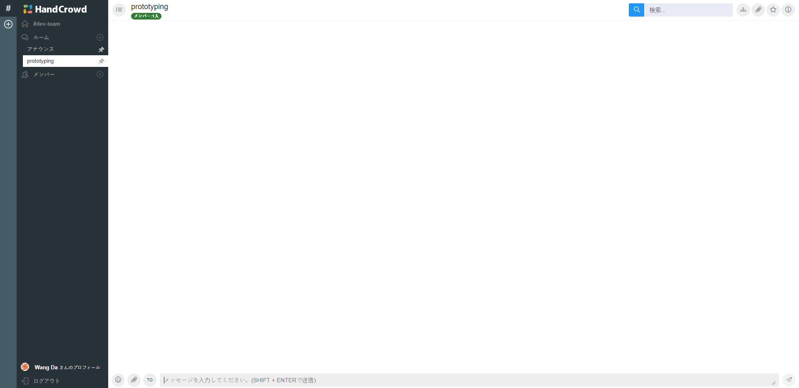
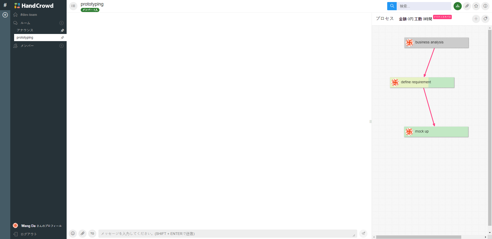
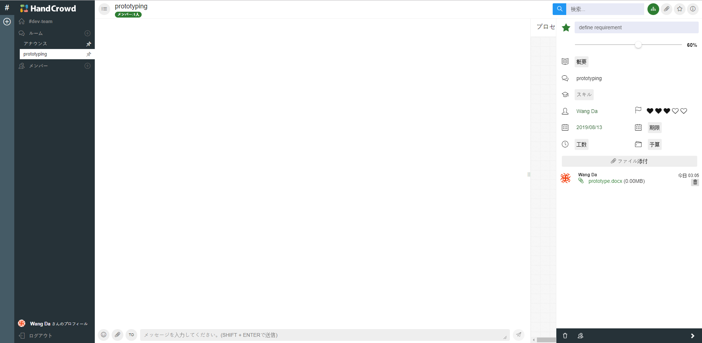
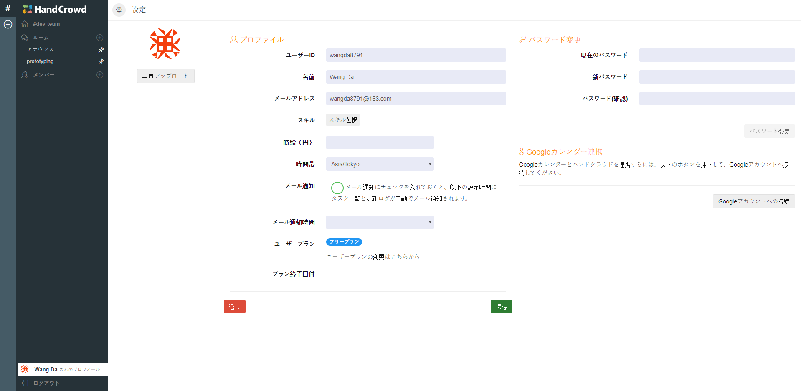
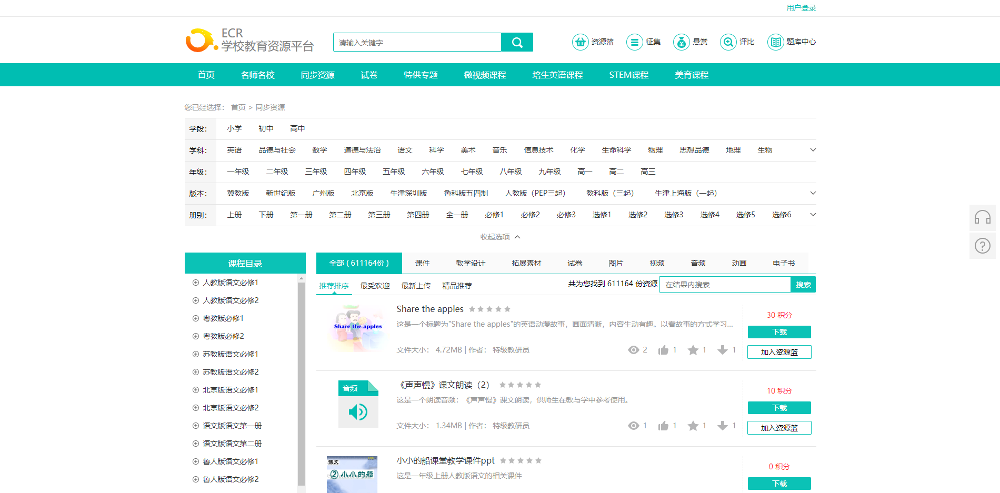
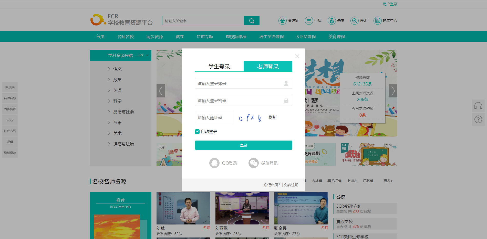
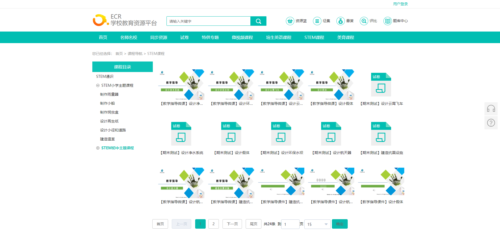
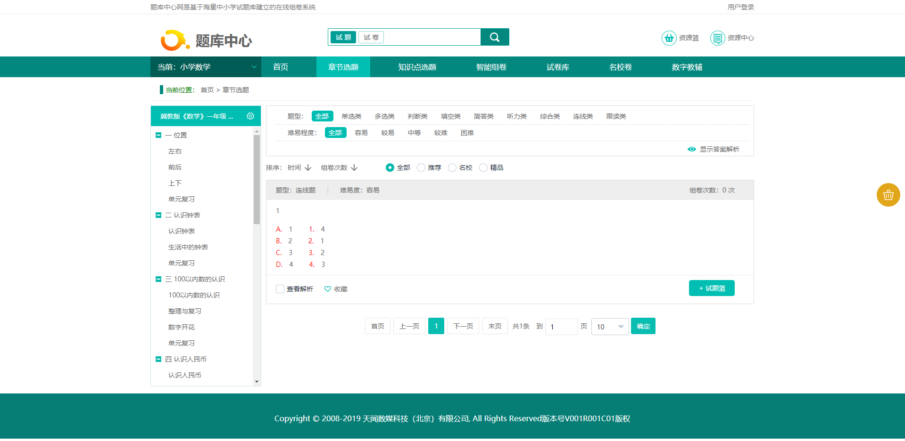
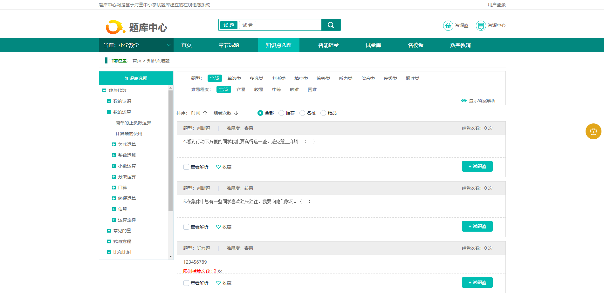

# Front end Engineer Challenge

## 1. About me

### Hand Crowd : www.handcrowd.com
Dec, 2015 - Feb, 2016

  HandCrowd is a cloud-type to-do list that supports work improvement for individuals and teams by disassembling work into flows.
  
  I did the job for the system from prototyping and implement to deployment and maintenance.

- Technologies used
  
  HTML5, CSS3, Javascript, Bootstrap Metronic Theme, Angular, SVG, Raphael.Js, Node.js, WebSocket, Adobe Photoshop, PHP, MySQL, Laravel, Gulp

- Screen

  

  

  

  

  

  

### ECR 学校教育资源平台 : ecr.teewon.net
May, 2016 - Jun, 2019

  ECR 学校教育资源平台 is a educational resource management system that supports C2C based resource sharing on the platform.
  This system is targeted of being used on vast area of Chinese schools, and so it is designed to be working on cloud based distributed envrionment.

  I played role of techical lead and senior frontend web developer to design microservice based architecture and draw the MVP for the product. Mostly I have part of implementing Frontend using Vue.js.

- Technologies used
  
  HTML5, CSS3, Javascript, Element-UI, Vue.js, Node.js, Webpack, Elastic search, Java Spring Boot, PostgreSQL, Microservice, Adobe Photoshop

- Screen

  

  

  

  

  

  

## 2. General

##### 2.1. What kind of front end projects do you enjoy working on? Why?
  - Firstly I enjoy working on front end prject interacting with backend to manage information.
  I have strong background on backend of database designing and rest api development, and so I am good at consuming it also.

  - Secondly I love to implement WebRTC based video chat or conference application with major business objectives coming with that functionality. One of those is telehealth consulting projects, which secure messaging, often HIPPA compliant, is the major part with integration of several privacy information related with healthcare, and I think it can be other types also.

  - Thirdly I like to work on front end project servicing live or VoD streaming. I have video broadcasting, processing and streaming experience also and had been working on it for 4+ years and it's my favorite experience.

  - In terms of technical I like to work on `MEAN`, `MEVN` and `MERN` stack. JavaScript is one of my first language which I love and experienced a lot. I like these stacks that all the job is done with fancy JavaScript working.

##### 2.2. Which are your favorite features of HTML5? How have you used them before?
  - The canvas, video and audio tags giving great multimedia feature, which I love to use.
  - New tags introduced for sections and outlines in HTML5, though I don't use that so much. It's still cool.

##### 2.3. Explain the difference between creating a DOM element setting `innerHTML` and using `createElement`.
  - Creating a DOM element using innerHTML is what browser parse and do to append to DOM structure, and soundly says it's faster than using createElement. Anyway it's what browser does in its' way.
  Using createElement the DOM object is created and appended to target DOM element, and it's tatical. Attaching every new DOM object is affecting the performance which lead us using DocumentFragment.

  - Anyway these two has pros and cons.
  I mostly use innerHTML to create totally new UI portion.
  And I use createElement to add some element into the mounted Document, which is the case mostly happen to grab the created element to do the next step.

##### 2.4. Compare two-way data binding vs one-way data flow.
  There are two different aspect here. Two-way vs. One-way and Data binding vs. Data flow.
  - In two-way data binding of Angular and Vue, Component and HTML notify the modification each other on the others' change. This was leading use of watcher which impacts performance a lot, which was in Angular.js (1.x).
  As of Vue.js does not use watcher instead it uses setter and getter to notify the modification.
  In one-way data flow of React, only Component modifies HTML but not vice-versa.

  - And here what binding and flow comes, which means it detects in binding by using watcher or setter/getter but it flows in data flow by calling re-render.

##### 2.5. Why is asynchronous programming important in JavaScript?
  - JavaScript runs in single-thread.
  All the parell jobs should be done in the deep care of asynchronous programming delima.
  Which means we should know about one tick in single thread and should understand the best practices or design pattern for asynchronous programming.
  Without that it totally blocks the whole application or severly impact the performance.


## 3. [Styling](./q3/README.md)

## 4. SPA
  I used Vue.js, and implemented all requirement and bonus note.
  For comments section I just implemented the UI and placed some mocking skeleton.

### Client

Head into `front-end/q4/client` and install the client dependencies using:

```bash
npm install
```

Run the client using:

```bash
npm start
```

The client should be launced on the browser automatically after building is completed.


### Server

In order to solve this problem, a simple server is provided, which you should use to get the data.
Head into `front-end/q4/server` and install the server dependencies using:

```bash
yarn install
```

or

```bash
npm install
```

Run the server using:

```bash
yarn server
```

or

```bash
npm run server
```

The server should be running on port `3000`.

#### Available routes

#### http://localhost:3000/books

Returns a list of books, with their info.

#### http://localhost:3000/books/SLUG

Returns the book information for the given SLUG (404 otherwise).
